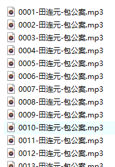

# 简介

**功能：**

 调整唱戏机内存卡歌曲的播放顺序。

**原理：**

放入唱戏机的mp3文件一般是按照**文件名**或**文件修改时间**升序排序并播放的，因此通过修改mp3文件的这两个属性，就能控制播放顺序。

# 使用

接下来依次修改文件名和文件修改时间，控制播放顺序。

1、先把一个目录下的mp3文件，通过**ReNamer**工具重命名，命名规则为：假设所有的文件总个数为3位数，按照`001-xx.mp3,002-xx.mp3,003-xx.mp3,...`的格式给文件命名，四位数则按照`0001-xx.mp3,0002-xx.mp3,0003-xx.mp3,...`的格式命名，以此类推。前边补0对齐的目的是让代码读出来的文件顺序和看到的顺序是一致的，如果不补0对齐，会导致代码读取顺序和看到的顺序不一致。示例如下：

经过这一步，文件已经根据名字按照想要的顺序排序好了。

2、接下来运行本工具，会提示**输入音频目录**，用户根据实际情况输入路径，例如输入`D:\下载\评书`。然后工具会把目录下所有音频文件的修改时间按照名字排序的顺序依次递增做修改。注意：目录下不要有子目录。修改完之后，若用户查看目录下音频文件的修改时间，会发现文件的修改时间是依次递增2秒的，且第一个文件的修改时间是工具开始运行时间的一年前。

3、把`D:\下载\评书`拷贝到内存卡上，插入唱戏机，即可按照这个顺序依次播放。